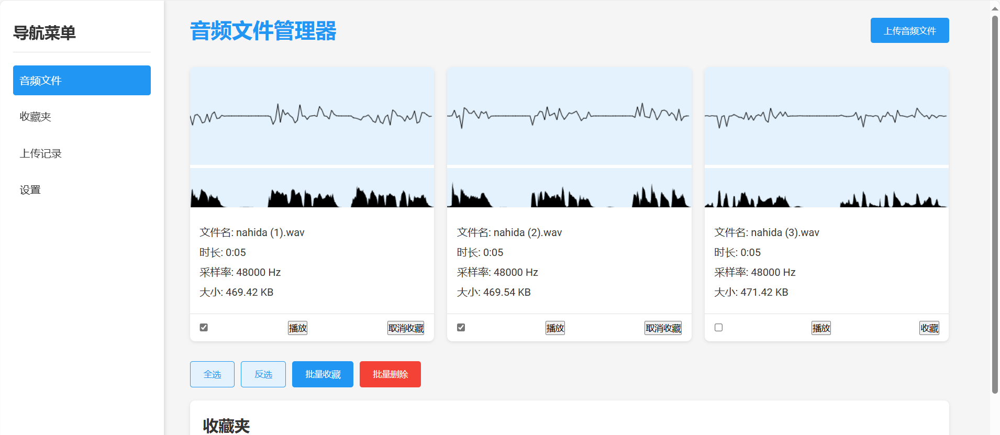

# Audio File Manager

A modern web application for managing and visualizing WAV audio files with features for playback, favorites, and batch operations.

## Features

- Upload WAV files via drag-and-drop or file selection
- Visualize audio waveforms
- Play audio files directly in the browser
- Add/remove files to/from favorites
- Batch operations (select all, invert selection, batch favorite, batch delete)
- Responsive grid layout
- Modern UI with hover effects and tooltips

## Technical Stack

- HTML5
- CSS3 (with CSS Grid and Flexbox)
- JavaScript (ES6+)
- Web Audio API
- Canvas API

## Usage

1. Open `index.html` in a modern web browser
2. Click "Upload Audio Files" or drag and drop WAV files
3. Use the interface to:
   - View audio waveforms
   - Play audio files
   - Add/remove favorites
   - Perform batch operations
   - View file details
   - Remove files

## Demo

# 音频上传快捷浏览与收藏网页小工具开发

## 项目概述
请编写一个网页，具有上传音频wav文件、对其时域波形、瞬时频率、瞬时包络、频谱进行可视化、播放音频、点选收藏的能力。

## 需求详情
点击按钮，弹出上传音频对话框，默认筛选wav文件，可以一次性多选wav文件，进行上传。上传音频应追加至已上传的音频后面，避免覆盖。若有与已上传的音频同名的文件，应弹窗提示是否覆盖上传。若用户点击【是】，则覆盖上传；若点击【否】，则取消本次上传。

上传时，请用进度条弹窗提示。上传完毕时，用绿色勾提示上传完毕，等用户点击确认键。

上传完毕后，在网页中央合适区域，逐卡片罗列显示上传的音频文件。每张卡片表示一个音频，请取合适的高度宽度，尽可能饱满显示卡片中的内容。卡片最上方展示波形图，当鼠标悬浮在波形图上时，卡片右上角显示一个小红叉，用于移除此上传的音频。波形图下方展示文字详情区域，包括该音频的文件名、时长、采样率、文件大小，每个属性独占一行，超出的部分用省略号代替，并在鼠标悬浮时用跟随鼠标的小贴士展示完整的字段内容。在卡片最下方留一行作为控制区。控制区内含有复选框，方便用户多选操作。控制区内还有播放键，方便用户点击播放音频内容听。控制键内还有收藏键，点击以后，将该文件名注册到收藏夹列表中，同步更新收藏夹列表显示，并切换成【已收藏】字样，再点击一下，则取消收藏，并切换为【收藏】字样。

所有卡片呈现方阵布局，列数可以随浏览器宽度动态调整，请取合适的间距。
所有卡片最下面，请展示按钮区，包括全选、反选、批量收藏键、批量删除键。只有当用户选中一个及以上的复选框时，才显示该按钮区，否则隐藏该按钮区。当用户点击批量收藏键时，将所有选中音频的文件名注册到收藏夹中。当用户点击批量删除则移除所有选中的音频。

在按钮区下方，是收藏夹列表区域，用于展示用户收藏的音频文件。按列表布局，表头包括{序号、文件名、收藏日期、操作}。每行显示一个收藏的音频信息。在操作列，拥有【取消收藏】的按钮，用于将该音频移除收藏夹，同时注意同步更新卡片中的按钮字样。

## 设计风格
- 现代简约风格
- 蓝色和浅色为主色调

## 技术栈
- HTML
- CSS
- JavaScript

## 文件结构
- `index.html`：主页
- `styles.css`：样式文件
- `main.js`：响应文件
- `assets/`：静态资源文件夹

## 使用说明
直接在浏览器访问`index.html`即可打开主页

# AI创作声明
以上为本项目的AI编程提示词，原创，欢迎提出改进意见

